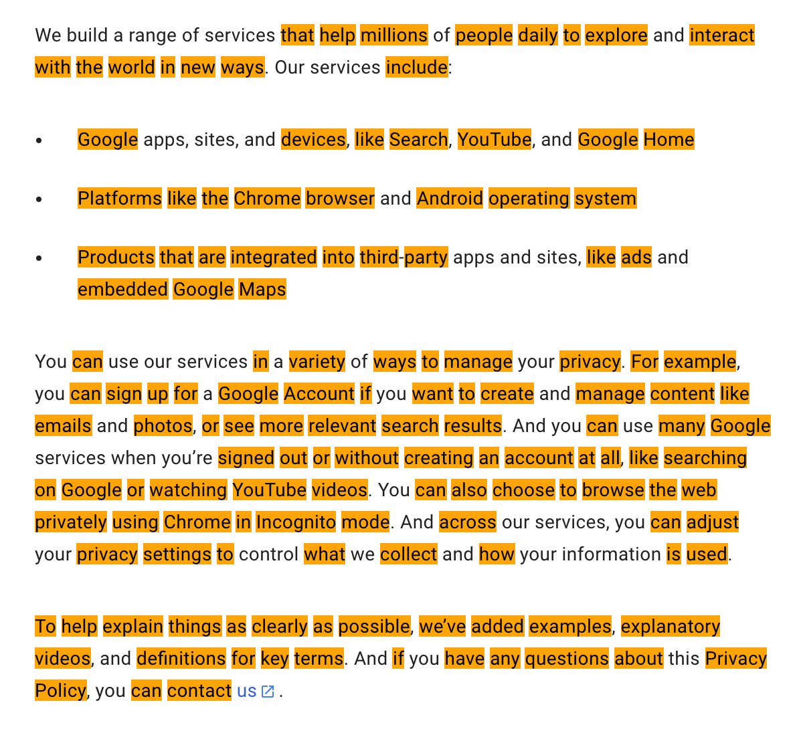

# YOURVOCAB

Yourvocab Browser Extension

Maintain your vocabulary. Activate the extension on a page and click on the words that you know. They will be added to your personal dictionary and never will be highlighed again on any other page. Easy like that!

## The upcoming features:

- See stats
  - how many words in your dictionary

- Setting your primary language

- Hovering on a word and see the following info: 
  - importance of the word
  - language
  - translation
  - pronunciation
  - see examples

- Maintain your dictionary
  - remove words
  - download the dictionary
  - upload words

- Mark words that you want to learn
  - they will be appearing on your screen time to time
